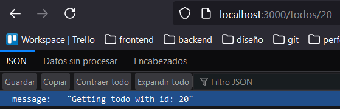

# REST API con Express y TypeScript

Uso de Typescript con Express.js para crear una REST API básica.

## Características

* Express.js: se utiliza para crear un servidor y gestionar las peticiones de red.
* TypeScript: lenguaje base para desarrollar la lógica de la aplicación.
* MVC: patrón de diseño utilizado para desarrollar la API.

## Instalación

1. Clonar el repositorio.
2. Ejecutar el comando ```npm install``` para instalar las dependencias y general el archivo __node_modules__.
3. Ejecutar el comando ```tsc -w``` para compilar el código de TypeScript a JavaScript.
4. Ejecutar el comando ```npm run dev``` para ejecutar el server.

Una vez el servidor este en ejecución, probar y agregar nuevos endpoints con su respectiva lógica.

